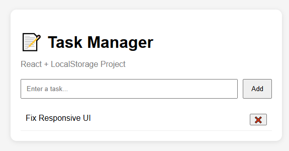

# 📝 React Task Manager

A simple and responsive **Task Management application** built using **React.js**.  
This project demonstrates core frontend development concepts including component-based architecture, state management, and persistent storage using LocalStorage.

---

## 🚀 Live Demo
https://rajprateekwork.github.io/task-manager/

---

## 📸 Preview

---

## ✨ Features

- ➕ Add new tasks
- 📝 Mark tasks as completed
- ❌ Delete tasks
- 💾 Persistent storage using LocalStorage
- 🎯 Clean and responsive UI
- ⚡ Real-time UI updates

---

## 🛠️ Tech Stack

- React.js (Vite)
- JavaScript (ES6+)
- HTML5
- CSS3
- LocalStorage API

---

## 🧠 Key Learnings

This project helped me strengthen:

- React functional components
- Props and state management
- useState & useEffect hooks
- Component reusability
- Basic UI/UX design principles
- Browser LocalStorage usage
